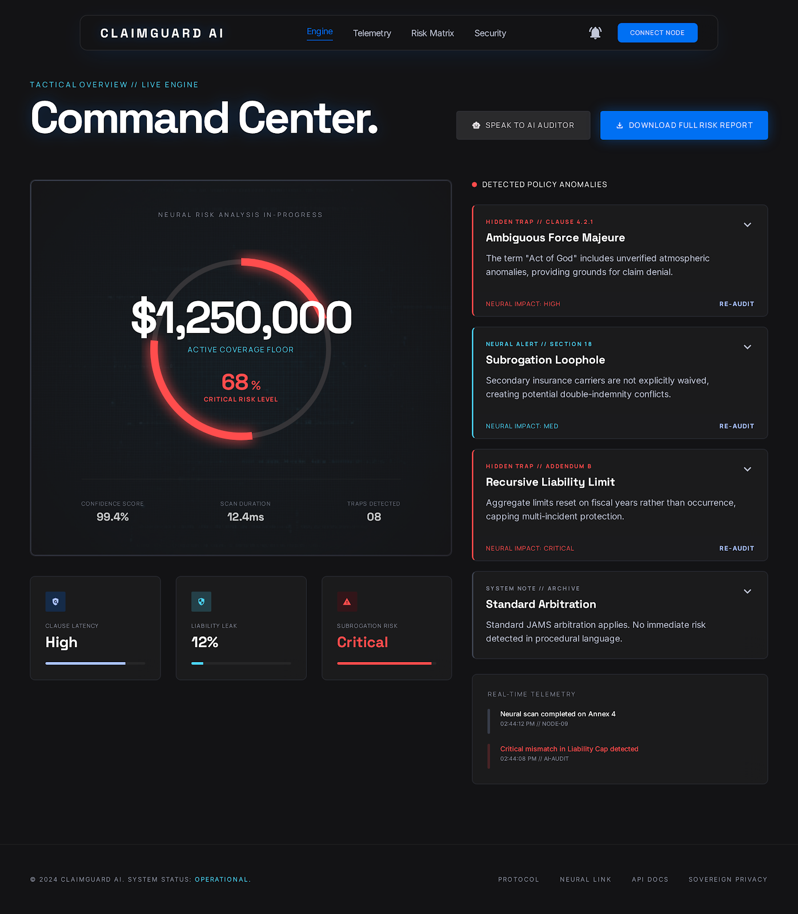

# 🚀 ClaimGuard AI v4.0  
## 🔐 Decode Policies. Predict Payouts. Prove Every Claim.

---

## 🌍 The Future of Insurance Intelligence

ClaimGuard AI is a full-stack **AI + Blockchain-powered Insurance Intelligence Platform** that transforms how users understand policies, analyze claims, and verify results.

❌ No more confusing insurance documents  
❌ No more uncertain claim outcomes  
❌ No more blind trust  

✅ AI explains everything  
✅ Instant payout prediction  
✅ Blockchain-backed verification  

---

## 🎥 Product Preview



---

## 🧠 Core Capabilities

### 🤖 AI-Powered Claim Analysis
- Understands complex insurance policies
- Analyzes repair bills intelligently
- Provides clear payout breakdown

### 📄 OCR Document Intelligence
- Extracts text from PDF, PNG, JPG
- Works with real-world documents

### 💰 Payout Prediction Engine
- Identifies:
  - ✅ Payable items  
  - ❌ Non-payable items  
  - 💸 Final claim amount  

### 🧾 Multi-Policy Comparison
- Upload multiple policies
- Get best recommendation

### 🔮 Scenario Simulation
- Run “what-if” insurance scenarios

---

## 🔐 Blockchain Trust Layer

- ⛓️ Stores proof of every result  
- 📜 Records key clauses + decisions  
- 🔍 Enables verification via transaction signature  

> Don’t just trust AI — verify it.

---

## 🏗️ System Architecture

```mermaid
flowchart TD
    A[Frontend UI] --> B[FastAPI Backend]
    B --> C[AI Engine]
    C --> D[Kaggle Models v8/v10]
    C --> E[OCR Processing]
    C --> F[Policy Logic Engine]
    F --> G[Claim Decision]
    G --> H[Hash Generator]
    H --> I[Solana Blockchain]
    I --> J[Proof + Signature]
    J --> A
🔄 How It Works
1️⃣ Upload Documents

User uploads:

Insurance Policy
Repair Bill
2️⃣ AI Processing
OCR extracts text
AI understands policy clauses
Matches bill items with coverage
3️⃣ Decision Engine
Calculates:
Payable items
Non-payable items
Total payout
4️⃣ Blockchain Proof
Output is hashed
Stored on blockchain
Transaction signature generated
5️⃣ Final Output
Clean UI shows:
Breakdown
Explanation
Verified proof
📊 Example Output
{
  "payable": ["Engine Repair", "Headlight"],
  "not_payable": ["Cosmetic Damage"],
  "total_amount": 3500,
  "blockchain_proof": "Verified",
  "signature": "5Kx...xyz"
}
🎯 Why This is a Game-Changer
Feature	Traditional Insurance	ClaimGuard AI
Policy Understanding	❌ Manual	✅ AI
Claim Prediction	❌ Uncertain	✅ Instant
Transparency	❌ Low	✅ High
Proof	❌ None	✅ Blockchain
User Control	❌ Limited	✅ Full
💡 Unique Selling Points (USP)
🧠 Explainable AI
🔗 Blockchain-based proof
⚙️ End-to-end automation
📊 Real-time results
🔮 Simulation engine
📈 Policy recommendation
🖥️ Tech Stack
⚡ FastAPI
🤖 Llama3 via Ollama
📄 OCR.space API
⛓️ Solana Blockchain
🎨 TailwindCSS
📁 Project Structure
ClaimGuard AI/
├── main.py
├── engine.py
├── solana_integration.py
├── stitch/
│   ├── hero_experience/
│   ├── analysis_lab/
│   └── results_dashboard/
├── requirements.txt
└── README.md
⚡ Quick Start
pip install -r requirements.txt
python main.py

Open: http://localhost:8000

🎤 Startup Pitch

ClaimGuard AI turns complex insurance into clear, explainable, and provable decisions using AI and blockchain.

🎬 Demo Flow
Upload policy
Upload bill
Click analyze
View results
Verify proof
🌟 Vision

To become the AI layer for insurance, where every decision is:

Transparent
Explainable
Verifiable
🏁 Final Impact

Transforming insurance from:
Confusion → Clarity
Uncertainty → Certainty
Trust → Proof

❤️ Built For
Hackathons
Startups
Real-world deployment
🚀 ClaimGuard AI

Because fine print shouldn’t win.


